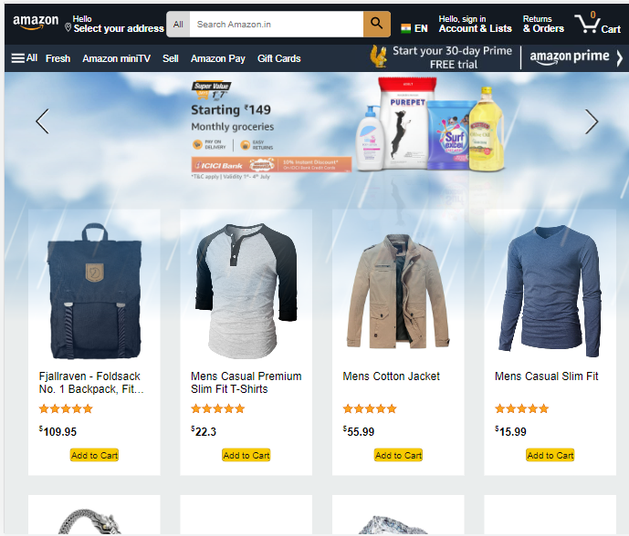

# Amazon Clone Web Application

This is a React-based Amazon Clone web application built to showcase my skills as a frontend developer. The project aims to replicate some of the core functionalities of the popular e-commerce platform Amazon. It utilizes technologies such as Firebase for user authentication, along with HTML, CSS, and React Hooks (useState, useContext, useReducer) for building a seamless user interface.

## Screenshots

  

## Demo Video 

A video showcasing the Amazon Clone Web Application in action.

https://github.com/juhikumarimodi6/React-Amazon-Clone/assets/71226446/7a6daba8-1627-4c39-9443-668e1273c0c1

## Technologies Used

- **React**: Frontend library for building user interfaces.
- **Firebase**: Provides backend services for user authentication.
- **HTML**: Markup language for structuring the web application.
- **CSS**: Styling language for designing the user interface.
- **React Hooks**: Allows the use of state and other React features in functional components.
- **useState**: React hook for managing state in functional components.
- **useContext**: React hook for accessing and managing global state across components.
- **useReducer**: React hook for managing complex state and state transitions.
- **API Fetch**: Utilized to fetch data from external APIs for product listing and search functionality.

## Functionalities

1. **Product Listing**: The application displays a comprehensive list of products with their names, prices, images, and relevant information. Product data is fetched using API calls to external APIs.

2. **User Authentication**: The web application allows users to sign up, log in, and log out securely. Firebase is utilized for handling user authentication, implementing proper security measures to protect user data and ensure privacy.

3. **Shopping Cart**: Users can add products to their shopping cart, which displays the total price. The application provides the flexibility to adjust product quantities or remove items as needed.

4. **Search Functionality**: The app features a search bar that allows users to easily find products based on keywords to refine search results. 

5. **Save for Later**: The "Save for Later" feature enables users to move items from their shopping cart to a separate list for future consideration, providing effective management of shopping preferences.
The "Save for Later" feature allows users to move items between their shopping cart and a separate Save for Later block. The following functionalities have been implemented:

- **Delete from Save for Later**: Users can delete an item from the Save for Later block if they no longer wish to keep it saved.

- **Move to Cart**: By clicking on the "Move to Cart" button for a specific item in the Save for Later block, users can easily transfer the item back to their shopping cart for immediate purchase.
These enhancements provide users with better control over their shopping preferences and allow them to manage their cart effectively.

6. **Responsive Design**: The web application is designed to be responsive and user-friendly for screen sizes greater than 800px, including desktops, tablets, and larger screens. It ensures a seamless user experience on these devices, with optimized layouts and styling.
For smaller screen sizes, such as smartphones and tablets in portrait mode, the application may still be functional but may not provide an optimal user experience. Future updates and improvements will focus on enhancing responsiveness for a wider range of devices.

## Getting Started

To run the Amazon Clone Web Application locally on your machine, follow these steps:

1. Clone the repository from GitHub: `https://github.com/juhikumarimodi6/React-Amazon-Clone.git`
2. Navigate to the project directory: `cd amazon-clone`
3. Install the required dependencies: `npm install`
4. Start the development server: `npm start`

## Showcase

This project serves as a demonstration of my frontend development skills and proficiency in working with modern web technologies such as React, Firebase, HTML, and CSS. Feel free to explore the source code and functionalities. I built this project to further solidify my understanding of React Hooks (useState, useContext, useReducer), and API fetch.

## Contributions

Contributions to enhance the functionalities and user experience of this project are welcome. If you find any bugs or have suggestions for new features, please open an issue or submit a pull request.

## Contact

For any inquiries or further information, feel free to reach out to me via email at [juhikumarimodi6@gmail.com](mailto:juhikumarimodi6@gmail.com).

---

Thank you for your interest in my Amazon Clone Web Application project! I hope it showcases my passion for frontend development and my dedication to creating meaningful user experiences. 
